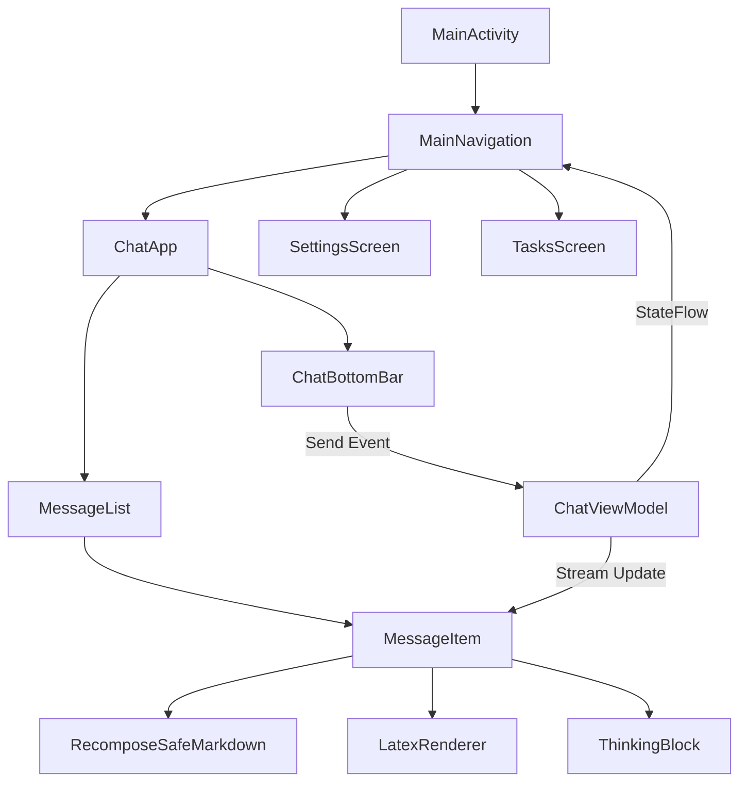

# 03_UI_ARCHITECTURE.md

## Overview
Agora's UI is built entirely with **Jetpack Compose (Material 3)**, following a strict **Unidirectional Data Flow (UDF)** pattern. The UI is designed to be responsive, immersive, and capable of rendering complex AI-generated content in real-time.

## Screen Hierarchy & Navigation
The application uses a custom-built navigation structure rather than a formal library, relying on state-driven visibility within `MainActivity`.

### 1. `MainActivity.kt`
- **Role**: Root entry point and navigation host.
- **Responsibilities**:
    - Manage the splash screen.
    - Handle deep links and notification intents (`handleNavigationIntent`).
    - Initialize the `AppContainer` (Manual DI).
    - Host the `MainNavigation` composable.
- **State**: Tracks which overlay is visible (`showSettings`, `showTasks`).

### 2. `ChatApp.kt`
- **Role**: Primary interaction layer.
- **Components**:
    - `ModalNavigationDrawer`: Houses conversation history and the settings entry point.
    - `ChatTopBar`: Displays conversation title, model selector, and system prompt switcher.
    - `MessageList`: A `LazyColumn` optimized for real-time streaming updates.
    - `ChatBottomBar`: Complex input area with attachment support, model overrides, and tool toggles.
- **Dynamic Content**: Uses `AnimatedContent` to transition between "New Chat" (Welcome) and active conversations.

### 3. `SettingsScreen.kt`
- **Role**: Configuration management.
- **Architecture**: A hierarchical "tabbed" system.
- **Design**: Uses `SettingsScaffold` with an iOS-style collapsing large-title pattern.
- **Pages**: Divided into detailed sub-pages (Providers, Models, RAG, Shell, Sandbox, etc.).

## Message Rendering Engine (`MessageItem.kt`)
This is the most complex UI component in the project. It handles:
- **Streaming Markdown**: Uses `RecomposeSafeMarkdown` to prevent UI flickering during rapid updates.
- **LaTeX Math**: Rendered via `LatexRenderer` (wrapping JLaTeXMath).
- **Thinking Blocks**: Collapsible reasoning sections with duration timers.
- **Tool Call Chains**: Visual indicators for multi-turn tool usage (e.g., "Searching web...", "Running command").
- **Branching**: Inline UI for switching between different model response versions.
- **Media**: Integrated video player, PDF viewer, and zoomable image gallery.

## State Management
- **Source of Truth**: `ChatViewModel.kt`.
- **Observation**: UI observes `StateFlow` (e.g., `messages`, `isLoading`, `currentActiveModel`).
- **Interaction**: UI triggers events via ViewModel methods (e.g., `sendMessage`, `regenerate`, `selectConversation`).
- **Throttling**: Streaming text is throttled (approx. 500ms) before updating the UI state to maintain high frame rates.

## Design System (`ui/theme/`)
- **`AgoraTheme`**: Implements Material You dynamic coloring.
- **Color Schemes**: Supports `MIDNIGHT`, `BLACK_HOLE`, `NATURE`, and standard Material tones.
- **Typography**: Custom scale using `JetBrains Mono` for code blocks and monospaced data.

## Animation Layer
- **Page Transitions**: Custom spring-based scale and fade transitions for settings overlays.
- **Streaming**: `TypewriterText` for a natural AI response feel.
- **Backgrounds**: `AnimatedBlobBackground` for decorative, low-resource ambient effects.

## Class Interaction Diagram (Simplified)

## Weaknesses
- **Component Size**: `MessageItem` and `ChatBottomBar` are monolithic and difficult to unit test.
- **Navigation State**: Relying on manual boolean flags in `MainActivity` for navigation can lead to "state explosion" as features grow.
- **Tight Coupling**: UI components frequently reference `ChatViewModel` directly instead of passing down smaller UI state models.
