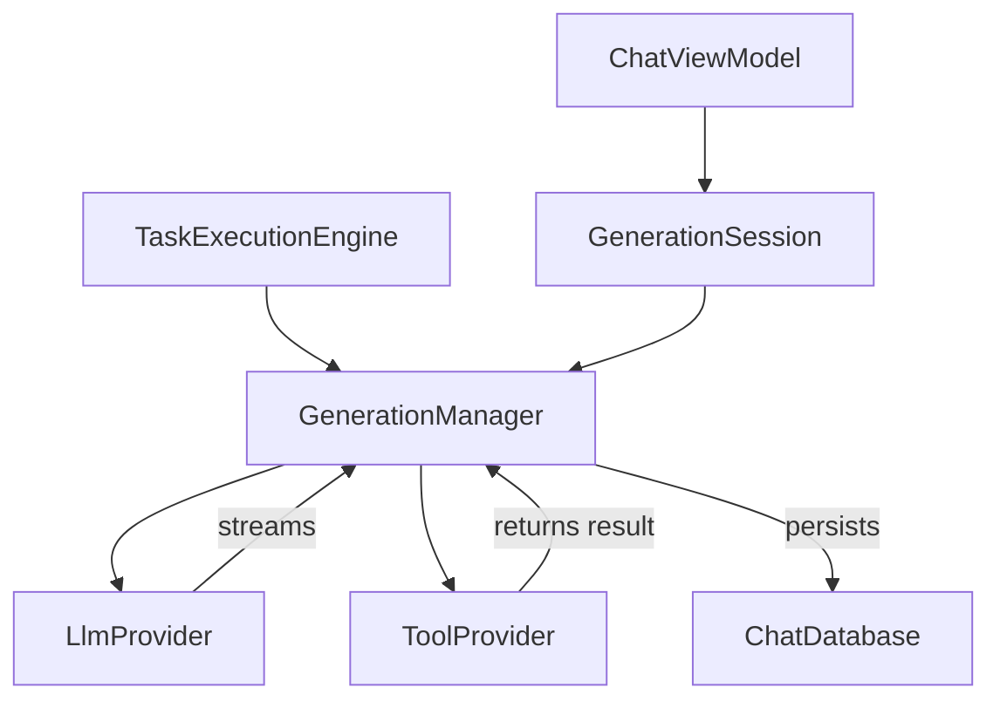

# 04_AGENT_ENGINE.md

## Overview
The Agent Engine is the core intelligence layer of Agora. It orchestrates the lifecycle of AI generations, including tool-calling loops, multi-modal processing, and autonomous background execution. It is designed to be "headless-first," allowing the same logic to drive both the interactive chat and scheduled background tasks.

## Core Components

### 1. `GenerationManager.kt`
The central orchestrator for a single generation session.
- **Responsibilities**:
    - Building the "API Path": Resolving the linear message history from the Room database tree.
    - Tool Discovery: Gathering all available `ToolProvider`s and collecting their definitions.
    - Foreground Lease: Starting `AgoraForegroundService` to prevent process death during inference.
    - The Generation Loop: Managing the continuous cycle of model response -> tool execution -> model response until a terminal state is reached.
    - Persistence: Ensuring final model responses and intermediate tool/result messages are saved to Room.

### 2. `TaskExecutionEngine.kt`
The "Headless" implementation of the engine.
- **Purpose**: Drives AI turns without a UI component.
- **Key Method**: `runOnce(conversationId, userText, ...)`
- **Mechanism**:
    - Locks the conversation to prevent concurrent foreground/background edits.
    - Injects a user turn.
    - Uses `GenerationRequestBuilder` to resolve system prompts and configuration.
    - Reuses the `GenerationManager.generate()` pipeline with a `headlessCallbacks` implementation (which persists data but emits no UI updates).

### 3. `GenerationSession` (Inner class of `ChatViewModel`)
Manages the "Foreground" state of generation.
- **Responsibilities**:
    - Token-gating: Ensures that only the most recent generation attempt can update the UI state.
    - Scope Management: Uses a dedicated `generationScope` that is cancelled if the ViewModel is cleared or the conversation is switched.

## Data Structures

### `GenerationConfig`
Input parameters for the LLM.
- `providerName`, `modelId`, `apiKey`.
- `effectiveSystemPrompt`: The resolved prompt after template substitution.
- `maxContextWindow`: Sliding window limit.
- `thinkingEnabled`, `thinkingLevel`: Reasoning parameters.
- `temperature`, `topP`, `maxTokens`: Sampling parameters.

### `GenerationContext`
Environmental context for tool execution.
- `accessSavedMemories`, `accessActiveMemory`: Memory flags.
- `webSearchEnabled`, `webSearchProvider`: Search config.
- `shellEnabled`, `shellDevices`: Remote access config.
- `imageTranscriptionEnabled`: Flag for vision-fallback processing.

## The Execution Flow (Sequence)
1. **Trigger**: User sends a message OR a scheduled task fires.
2. **Setup**: `GenerationManager` is initialized with the conversation ID.
3. **Path Construction**: The message tree is walked from the leaf to the root to build the list of previous turns.
4. **Tool Definitions**: `GenerationManager` polls all registered `ToolProvider`s for their JSON schemas.
5. **Initial Call**: The prompt (history + system prompt + tool definitions) is sent to the `LlmProvider`.
6. **Streaming**: `StreamEvent`s (Text, Thoughts, ToolCalls) are emitted.
7. **Tool Execution**:
    - If `ToolCallRequest` is received, `GenerationManager` identifies the provider.
    - `ToolProvider.execute()` is called (e.g., searching the web).
    - Result is wrapped in a synthetic `result_` message.
8. **Loop**: The updated path (including tool results) is sent back to the LLM.
9. **Finalization**: Terminal response is received, saved to DB, and the foreground service is released.

## Class Interaction Diagram

## Strengths
- **Decoupled Architecture**: The logic is shared between background and foreground paths.
- **Robust Multi-round Tools**: Can handle unlimited rounds of tool calling (bounded only by coroutine liveness).
- **Service-Protected**: High reliability during long-running tasks due to Foreground Service integration.

## Weaknesses
- **State Complexity**: Managing the `currentAnswerBuf` and `currentThoughtBuf` during streaming involves complex string manipulation and timing logic.
- **Recursive Risk**: While automation tools are disabled in background runs, there is still a risk of "runaway loops" if the model keeps calling tools without reaching a conclusion.
