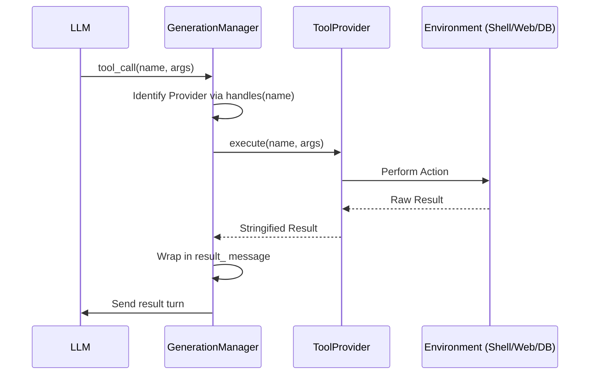

# 05_TOOL_SYSTEM.md

## Overview
Agora features a pluggable, deterministic tool system that allows LLMs to interact with the device, the internet, and remote servers. Every tool interaction follows a standard interface, ensuring that new capabilities can be added without modifying the core agent engine.

## Core Interface (`ToolProvider.kt`)
Every tool provider must implement three methods:
1. `definitions(ctx: GenerationContext)`: Returns a list of `ToolDefinition` (JSON schema for the LLM).
2. `execute(name: String, arguments: String, ctx: GenerationContext)`: Perform the actual logic and return a string result.
3. `handles(name: String)`: Returns true if this provider owns the given tool name.

## Built-in Tool Providers

### 1. `MemoryToolProvider.kt`
- **Purpose**: Persistent storage for agent-specific knowledge.
- **Tools**:
    - `list_memory_files`: Returns a list of `.md` files in the memory directory.
    - `read_memory_file`: Returns the content of a specific file.
    - `create_memory_file` / `edit_memory_file`: CRUD operations on markdown knowledge.
    - `update_active_memory`: Updates the primary context file prepended to all prompts.

### 2. `WebSearchToolProvider.kt`
- **Purpose**: External information retrieval.
- **Supported Backends**: Brave, Serper, Tavily, SearXNG, DuckDuckGo Lite.
- **Tools**:
    - `web_search`: Perform a keyword search.
    - `web_fetch`: Retrieve and scrape the raw text content of a specific URL.

### 3. `RagToolProvider.kt`
- **Purpose**: Semantic search over the local database.
- **Mechanism**: Delegates to `RagManager` which uses local or remote embeddings.
- **Tools**:
    - `search_conversations`: Finds relevant snippets from past chats based on the current query.

### 4. `ShellToolProvider.kt`
- **Purpose**: Execution of code and system commands.
- **Execution Environments**:
    - **Local Sandbox**: PRoot-based Alpine Linux.
    - **Remote Conch**: Securely encrypted session to a Conch server.
- **Tools**:
    - `execute_shell_command`: Runs an arbitrary command and returns stdout/stderr.
    - `file_read` / `file_write` / `file_edit`: Direct filesystem manipulation within the selected environment.

### 5. `ImageGenToolProvider.kt`
- **Purpose**: Text-to-image generation.
- **Integration**: Works with OpenAI-compatible `/v1/images/generations` endpoints.
- **Visuals**: Images are rendered inline within the chat stream.

### 6. `AutomationToolProvider.kt`
- **Purpose**: Self-modifying automation.
- **Tools**: Allows the model to create or schedule new tasks (disabled by default in background runs).

## Deterministic Identification
To ensure consistency across multi-round interactions:
- **Tool Call IDs**: Are generated as **SHA-256 hashes** of the `toolName:arguments` string.
- **Benefit**: This allows the model (and the server) to accurately link results to their specific requests even if turns are re-played or cached.

## Tool Execution Flow

## Security Model
- **User Gate**: Remote shell mutations (e.g., `file_write` on a server) require explicit user approval via a confirmation dialog in the UI.
- **Path Traversal Protection**: `MemoryToolProvider` and `ProotSandboxManager` use canonical path checks to prevent models from accessing files outside their designated directories.

## Possible Improvements
- **Output Streaming**: Large tool results (like long logs) currently block the generation loop until finished; they could be streamed as well.
- **Resource Constraints**: Tools lack a "timeout" parameter controlled by the model, which could lead to hangs in the Sandbox.
