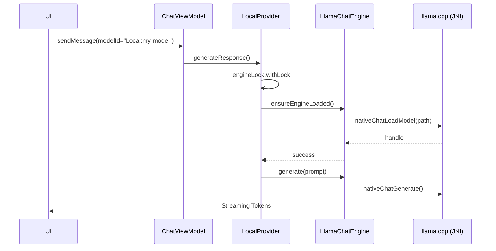

# 06_MODEL_SYSTEM.md

## Overview
Agora manages a complex heterogeneous model environment, supporting remote cloud-based LLMs (OpenAI, Anthropic, Gemini, etc.) and on-device GGUF models via `llama.cpp`. The system provides a unified identification and lifecycle management layer for both.

## Model Identification (`ModelId.kt`)
To avoid identifier collisions across different providers, Agora uses a typed `ModelId` wrapper.
- **Format**: `ProviderName:modelId` (e.g., `Anthropic:claude-3-5-sonnet-20240620`).
- **Canonical Parse Point**: The `ModelId.parse()` method handles both the modern prefixed format and legacy heuristics for older unprefixed IDs.
- **API Bare Name**: `ModelId.apiModelName` strips internal prefixes (like Google's `models/`) to prepare the ID for raw network requests.

## Local Inference Engine (`LlamaChatEngine.kt`)
This is the JNI bridge to the native `llama.cpp` library.
- **State**: Manages a `nativeHandle` (pointer to the C++ model/context).
- **Capabilities**:
    - **Multimodal**: Supports loading visual projectors (`mmproj`) for vision-capable local models.
    - **Template Management**: Can retrieve the Jinja2 chat template embedded in GGUF files and apply it to conversation history.
    - **Streaming**: Emits tokens via `Flow<String>` using a `callbackFlow`.
    - **Cancellation**: Supports immediate interruption of native generation loops via `nativeChatCancel`.

## Local Provider Implementation (`LocalProvider.kt`)
Adapts the raw `LlamaChatEngine` to the project's `LlmProvider` interface.
- **Concurrency**: Uses a `Mutex` (`engineLock`) to ensure only one local model is loaded into memory at a time (crucial for mobile RAM constraints).
- **Thinking Parser**: Integrates `ThinkingParser` to detect and extract `<think>` tags from local model output.
- **Stop Patterns**: Monitors the rolling token buffer for ChatML markers like `<|im_end|>` to terminate generation cleanly.

## Model Lifecycle & Management (`ModelManager.kt`)
- **Responsibilities**:
    - **CRUD**: Adding, deleting, and updating local GGUF model configurations.
    - **File Sync**: Automatically deletes associated `.gguf` and `.mmproj` files when a model entry is removed.
    - **Registry**: Updates the global "Available Models" and "Enabled Models" lists in `SettingsManager`.
    - **Aliasing**: Manages user-friendly names for cryptic model filenames.

## Embedding Engine (`LlamaEngine.kt`)
A specialized singleton for vector generation.
- **Logic**: Loads an embedding-optimized model, processes a batch of texts, and immediately frees the memory.
- **Mutex Protected**: Uses `modelMutex` to prevent concurrent access to the shared native embedding context.

## Discovery & Synchronization
- **ModelSyncManager**: Polls remote providers (OpenAI, Ollama, etc.) for their current model lists.
- **LM Studio Support**: Includes logic to discover models served by local LM Studio instances on the network.

## Loading Flow (Local Model)

## Weaknesses
- **Memory Pressure**: Swapping large local models is slow and risks OOM if the previous model isn't cleared fast enough.
- **Hardware Acceleration**: Currently restricted to CPU/GPU via basic NDK; could benefit from more specific Android NNAPI or Vulkan optimizations.
