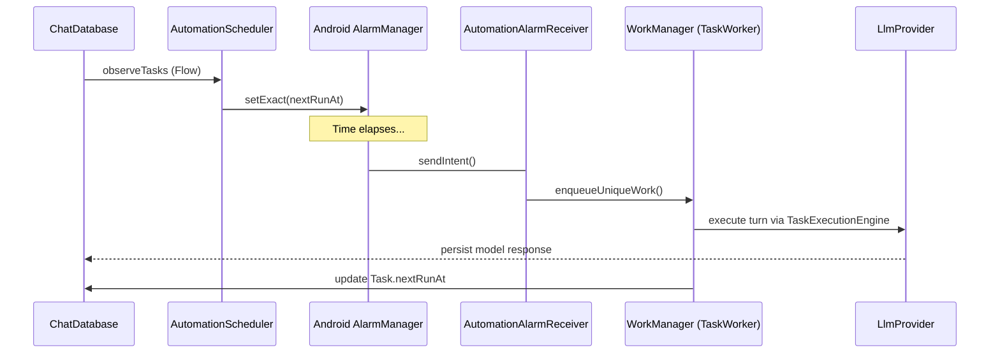

# 08_AUTOMATION.md

## Overview
The Automation system transforms Agora from a passive chat app into an autonomous platform. It allows users to define long-running tasks and persistent conversation loops that execute on the device even when the application is in the background.

## Core Architectural Pillars

### 1. `TaskManager.kt`
The high-level coordinator for scheduled, one-shot instructions.
- **Entity**: `TaskEntity` (Name, Prompt, Cron Expression, Model).
- **Functionality**:
    - **Scheduling**: Calculates `nextRunAt` using `CronExpression`.
    - **Execution**: Spawns a dedicated "Task Conversation" for each run.
    - **Graduation**: Allows the user to "take over" a task's chat, moving it from the task logs to the main history.

### 2. `LoopManager.kt`
Manages recursive, interval-based AI turns within a single thread of context.
- **Entity**: `LoopEntity` (Conversation ID, Interval, Max Cycles, Active Status).
- **Mechanisms**:
    - **Optimistic Concurrency**: Uses a `revision` counter to ensure that a background execution won't overwrite a manual "Stop" command from the UI.
    - **Cycle Control**: Automatically deactivates after reaching `maxCycles`.

### 3. `AutomationScheduler.kt`
The bridge to the Android system's low-level scheduling APIs.
- **AlarmManager**: Used for high-precision, one-shot wakeups.
- **Intents**: Fires `AutomationAlarmReceiver` with specific action types (`ACTION_FIRE_TASK`, `ACTION_FIRE_LOOP`).
- **Doze Compatibility**: Uses `setExactAndAllowWhileIdle` (when permitted) to ensure agents fire on time.

## Background Execution Strategy

### `TaskWorker.kt` & `LoopWorker.kt`
- **Framework**: Android **WorkManager**.
- **Role**: Provides a reliable execution environment that survives process death.
- **Foreground Transition**: Immediately promotes itself to a Foreground Service (via `AutomationForegroundInfo`) to ensure the Android OS doesn't kill the heavy LLM inference process.
- **Retry Policy**: Implements exponential backoff for transient provider failures (e.g., API timeouts).

## Scheduling Logic (`CronExpression.kt`)
A pure Kotlin implementation of the standard 5-field cron format (`min hour dom month dow`).
- **Features**: Supports lists (`1,15`), ranges (`1-5`), and step values (`*/15`).
- **Predictive**: Computes the `next()` matching timestamp from any given start point.

## Automation Execution Flow

## Guardrails (`LoopPolicy.kt`)
To prevent battery drain and API cost explosions:
- **Min Interval**: 60 seconds.
- **Max Cycles**: Default 10, capped at 100.
- **Validation**: Strict bounds checking before persisting any loop or task.

## Future Improvements
- **Trigger System**: Moving beyond simple time-based triggers to event-based triggers (e.g., "Run task when I receive a text message from X").
- **Parallelism**: Currently, the system uses a `GenerationQueue` to serialize AI turns; background tasks might wait behind foreground chat.
