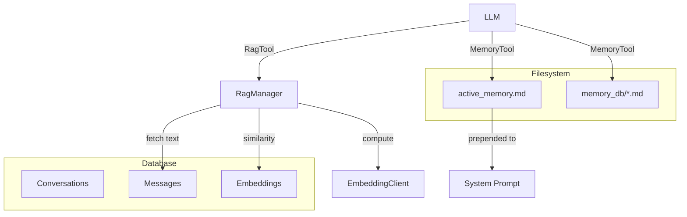

# 09_MEMORY_SYSTEM.md

## Overview
Agora implements a multi-tier memory system designed to provide LLMs with both long-term factual knowledge and cross-conversation context. It combines a simple filesystem-based "External Brain" with a vector-based "Semantic Search" (RAG).

## Tier 1: Working Memory (Filesystem)
Managed by `MemoryManager.kt` and accessed via the `MemoryToolProvider`.

### `active_memory.md`
- **Role**: The most critical context.
- **Implementation**: The contents of this file are **prepended** to the system prompt of every generation request (if memory access is enabled).
- **Model Control**: The AI can call `update_active_memory` to persist important facts about the user or the current mission.

### `memory_db/` Directory
- **Role**: Long-term document storage.
- **Implementation**: A collection of Markdown files stored in the app's internal data directory.
- **Model Interaction**:
    - `list_memory_files`: Discover available knowledge modules.
    - `read_memory_file`: Retrieve detailed documentation.
    - `create_memory_file` / `edit_memory_file`: Build a persistent knowledge base.

## Tier 2: Associative Memory (RAG)
Managed by `RagManager.kt` and powered by the `embeddings` table in Room.

### Vector Retrieval
- **Mechanism**: Converts past conversation messages into high-dimensional vectors (embeddings).
- **Search**: Uses **Cosine Similarity** to find messages that are semantically related to the current query.
- **Flexibility**: Users can choose between local GGUF embedding models (for privacy) or cloud APIs (for performance).

### `RagToolProvider.kt`
- **Tool**: `search_conversations(query)`.
- **Logic**:
    1. Compute embedding for the query.
    2. Load all indexed message vectors for the current model.
    3. Sort by similarity score.
    4. Return the top N snippets to the LLM as context.

## Data Layer (`EmbeddingEntity.kt`)
- **`messageId`**: Link to the original chat turn.
- **`chunkText`**: A copy of the text (or a summary) to avoid expensive DB joins during rapid similarity checks.
- **`embedding`**: Raw byte array of float32 values.

## Memory Maintenance
- **`EmbeddingCacheWorker.kt`**: A background job that iterates through the entire conversation history to index new or modified messages.
- **Auto-Cache**: When enabled, the app computes and saves an embedding immediately after a message is persisted to the database.
- **Cleanup**: `deleteOrphanedEmbeddings()` runs on startup to remove vectors pointing to deleted messages.

## Architectural Flow

## Security & Path Integrity
- **Canonicalization**: All file-based memory operations check `File.canonicalPath` to ensure the model cannot "escape" the `memory_db/` folder via `../` path traversal attacks.

## Weaknesses
- **Embedding Invalidation**: If the user edits a past message, the embedding isn't always updated immediately unless "Auto-Cache" is toggled on.
- **Scaling**: Cosine similarity is currently performed in-memory on the app side; as the message history grows to tens of thousands, a dedicated vector index (like HNSW) might be required.
