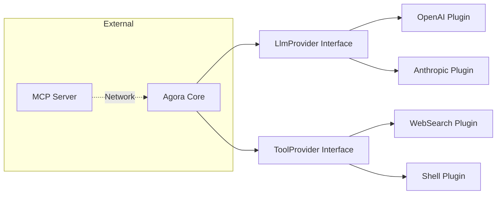

# 10_PLUGIN_SYSTEM.md

## Overview
Agora does not use a dynamic `.jar` or `.so` loading system for plugins. Instead, it employs a "Source-Level Plugin Architecture" where new capabilities are added as modular implementations of core interfaces. This ensures type safety, performance, and deep integration with the Android lifecycle.

## Extension Points

### 1. Model Providers (`LlmProvider`)
- **Purpose**: Allows adding new AI backends (e.g., a new cloud provider or a local inference engine).
- **Registry**: `ProviderRegistry.kt` manages the active instances of these providers.
- **Contract**: Providers must handle streaming responses (SSE) and model list fetching.

### 2. Agent Tools (`ToolProvider`)
- **Purpose**: Extends the AI's physical capabilities (Web, Shell, Memory).
- **Registration**: Tools are gathered in `GenerationManager.buildToolProviders()`.
- **Interface**: Requires providing a JSON schema for the model to understand how to call the tool.

### 3. Native Extensions (`JNI`)
- **Purpose**: High-performance or system-level tasks that Kotlin cannot perform efficiently.
- **Examples**: `llama.cpp` for inference, `proot` for virtualization.
- **Linking**: Managed via `CMakeLists.txt` and manual native library extraction.

## Plugin-like Features in the Web UI
The project includes a bundled web interface (inherited from `llama.cpp/tools/server/webui`) which has its own plugin system:
- **Markdown Plugins**: Rehype/Remark plugins for rendering custom attachments.
- **MCP Integration**: A comprehensive Model Context Protocol implementation in TypeScript for connecting to external tool servers.

## Future "MCP" Plugin Vision
Based on the current architecture, Agora is moving towards supporting the **Model Context Protocol (MCP)** as its primary plugin standard. This would allow:
- **Remote Tools**: The app could connect to an external server (e.g., running on a PC) and "borrow" its tools (Filesystem, Browser, DB) over the network.
- **Conch as Plugin**: Using the Conch protocol to expose Android-specific tools to external AI agents (like Claude Desktop).

## Architectural Diagram

## Possible Improvements
- **Dynamic Manifests**: Implementing a system where tools can be defined in external JSON/YAML files and loaded at runtime without recompiling.
- **Scripting Support**: Adding a Python or Lua interpreter within the Sandbox to allow "scriptable plugins."
