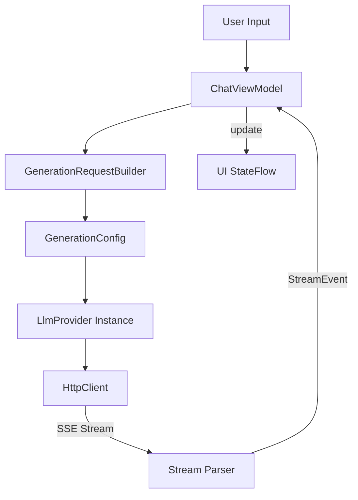

# 11_PROVIDER_SYSTEM.md

## Overview
The Provider System is the abstraction layer that allows Agora to communicate with various LLM backends using a unified interface. It handles the nuances of different API protocols (OpenAI SSE, Google's bespoke SSE, Anthropic's event-stream) and translates them into a common internal event format.

## Core Interface (`LlmProvider.kt`)
- **Properties**: `name`, `defaultBaseUrl`.
- **Methods**:
    - `generateResponse(messages, config)`: Returns a `Flow<StreamEvent>`.
    - `fetchModels(apiKey, baseUrl)`: Retrieves the list of supported models from the remote endpoint.

## Universal Event Format (`StreamEvent`)
All providers must emit these sealed class events:
- **`TextChunk`**: Incremental response text.
- **`ThoughtChunk`**: Incremental reasoning text.
- **`ToolCallRequest`**: Model's request to execute a physical action.
- **`UsageUpdate`**: Metadata about token consumption.
- **`Error`**: Provider-specific failure messages.

## Backend Implementations

### 1. OpenAI Ecosystem (`api/openai/`)
- **`BaseOpenAiProvider.kt`**: A template class for all OpenAI-compatible endpoints.
- **Subclasses**: `OpenAiProvider`, `DeepSeekProvider`, `QwenProvider`, `OpenRouterProvider`, `CustomOpenAiProvider`.
- **Special Logic**: Handles the `reasoning_content` field (used by DeepSeek-R1 and OpenAI o1) and translates it into `ThoughtChunk`s.

### 2. Anthropic Claude (`AnthropicProvider.kt`)
- **Protocol**: Uses the `anthropic-version: 2023-06-01` custom SSE stream.
- **Thinking**: Supports the new "Extended Thinking" mode via the `budget_tokens` parameter.
- **Multi-modal**: Efficiently packages images into base64 blocks within the message history.

### 3. Google Gemini (`GeminiProvider.kt`)
- **Features**: Native support for **Code Execution** and **Google Search** tools.
- **Reasoning**: Integrates Gemini 2.0 reasoning tokens.
- **Safety**: Passes through detailed safety rating metadata.

### 4. Local Inference (`LocalProvider.kt`)
- **Implementation**: Wraps `LlamaChatEngine` (JNI).
- **Templates**: Uses the GGUF's internal chat template to format the prompt correctly for the specific model architecture (e.g., Llama 3, Mistral, Gemma).

### 5. Ollama (`OllamaProvider.kt`)
- **Role**: Connects to self-hosted Ollama servers on the local network.
- **Discovery**: Uses the `/api/tags` endpoint to automatically sync available models.

## Message Conversion Logic (`MessageConverter.kt`)
Each provider has unique requirements for historical message formatting:
- **Tree Flattening**: Converts the non-linear Room database path into a linear list of messages.
- **Role Mapping**: Maps internal `Participant` enums (USER, MODEL) to API roles (user, assistant, system).
- **Tool Mapping**: Translates `tool_` and `result_` messages into the provider's specific tool-turn syntax (e.g., `tool_use` blocks for Anthropic).

## Request Pipeline

## Resilience Features
- **Auto-Retry**: The `BaseOpenAiProvider` includes logic to retry transient network errors (429, 5xx) with exponential backoff.
- **Timeouts**: Generous 30s connection and 60s read timeouts to handle slow reasoning models.

## Possible Improvements
- **Streaming Tool Results**: Currently, tool results are sent back in a new request; some providers (like Gemini) might support faster ways to integrate results.
- **Load Balancing**: Support for cycling between multiple API keys or base URLs for a single provider.
