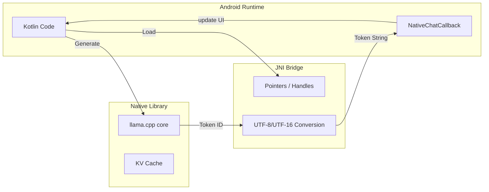

# 14_NATIVE_LAYER.md

## Overview
The Native Layer is the high-performance backbone of Agora. It leverages the Android NDK and C++17 to integrate heavy-duty AI inference and virtualization libraries that are impractical to implement in pure Kotlin.

## Build Orchestration (`CMakeLists.txt`)
- **Minimum Version**: 3.22.
- **Dependency Strategy**: Uses `add_subdirectory` to link directly to the `llama.cpp` and `proot` source code (via git submodules), enabling cross-compilation optimizations (e.g., `-O3`, `-flto`).
- **Reproducible Builds**: Implements `llvm-objcopy` logic to strip `.comment` sections and uses `SOURCE_DATE_EPOCH` to ensure identical binaries across builds.

## Primary Libraries

### 1. `agora_llama` (shared library)
- **Source**: `llama_jni.cpp`, `llama_chat_jni.cpp`.
- **Linking**: Links against `llama` (core) and `mtmd` (multimodal).
- **Responsibilities**:
    - **Inference**: High-speed token generation using `llama.cpp`.
    - **Sampling**: Implements a chain of samplers: `min_p` -> `top_p` -> `temp`.
    - **Memory**: Manages the KV (Key-Value) cache for efficient multi-turn conversations.
    - **JNI Translation**: Handles the conversion between Kotlin's `String` and C++'s UTF-8, specifically solving the "Modified UTF-8" incompatibility in Android's `NewStringUTF` for 4-byte characters (emojis, math symbols).

### 2. `agora_proot` (shared library)
- **Source**: `proot_jni.cpp`.
- **Purpose**: A minimal JNI library that serves as a marker for the Android Package Manager to extract the actual `proot` binaries (`libproot_exec.so`) to the data partition.

## Key Native Functions

### `llama_chat_jni.cpp`
- `nativeChatLoadModel`: Loads a GGUF file and initializes the `llama_context`. Sets up an `abort_callback` linked to a volatile `cancelled` flag.
- `nativeChatApplyTemplate`: Executes the model's internal Jinja2 chat template to format history.
- `nativeChatGenerate`: The core loop. It performs tokenization, prefill, and incremental sampling. It emits tokens back to Kotlin via a provided `NativeChatCallback`.

### `llama_jni.cpp`
- `nativeComputeEmbedding`: Optimized for batch processing of text snippets. It encodes the text, decodes the last hidden layer, and performs pooling (e.g., MEAN pooling) to produce a vector.

## Performance Optimizations
- **NEON/SIMD**: Compiled with ARM NEON instructions enabled for vector acceleration on mobile CPUs.
- **Threading**: Uses a fixed number of threads (typically 4-8 depending on device) to avoid thermal throttling.
- **ABI**: Strictly `arm64-v8a` to utilize 64-bit registers and wider memory paths.

## Data Flow (Native JNI)

## Security & Reliability
- **Resource Management**: Implements `finalize()` and `Closeable` in Kotlin to ensure the `nativeChatFreeModel` is called, preventing native memory leaks.
- **UTF-8 Safety**: Includes `utf8_complete_prefix_len` to handle multi-byte characters that are split across token boundaries, preventing crashes when passing partial bytes to the JVM.

## Possible Improvements
- **Vulkan/GPU**: Enabling `GGML_VULKAN` to leverage the phone's GPU for even faster inference.
- **Quantization**: Native support for loading pre-quantized models (iMatrix) to improve accuracy at 4-bit weights.
吐
