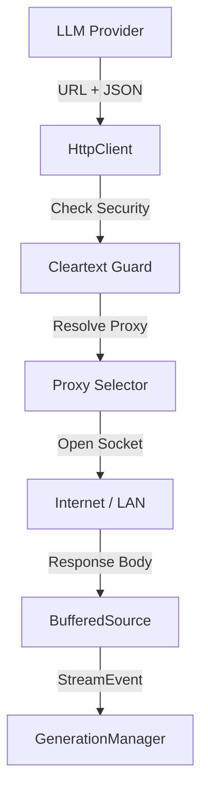

# 15_NETWORK_LAYER.md

## Overview
The Network Layer in Agora is built around the **OkHttp** library. It is designed to handle long-lived connections for real-time AI streaming (Server-Sent Events) and provides a secure, proxy-aware pipeline for all external API communications.

## Core Singleton (`HttpClient.kt`)
Unlike many Android apps, Agora uses a single, globally shared OkHttp instance to maximize connection pooling and reduce latency.

### 1. Security Guards
- **`guardCleartextCredentials`**: A fail-closed security mechanism. It refuses to transmit API keys or authorization headers over plain `http://` unless the target host is a known local address (e.g., `localhost`, `ollama`, or private IP ranges).
- **`isLocalHost`**: Accurately detects LAN and loopback addresses to allow unencrypted local model communication while protecting cloud credentials.

### 2. Streaming Support (`StreamHandle`)
- **SSE Integration**: Designed for Server-Sent Events. The `streamPost` method returns a `StreamHandle` which wraps the raw `BufferedSource`.
- **Cancellation**: `StreamHandle.cancel()` allows the generation engine to immediately sever the network socket when a user taps "Stop," preventing unnecessary data usage and billing.

### 3. Proxy System
Agora includes a built-in proxy selector supporting both **HTTP** and **SOCKS** proxies.
- **Dynamic Switching**: The proxy configuration can be updated at runtime without rebuilding the client, thanks to the `@Volatile proxyConfig` and a custom `proxySelector`.
- **Authentication**: Supports basic authentication for HTTP proxies and provides a global `java.net.Authenticator` for SOCKS proxy credentials.
- **Bypass Logic**: Supports CIDR-based (e.g., `192.168.1.0/24`) and wildcard-based (e.g., `*.local`) bypass lists.

## Configuration Details
- **Connection Timeout**: 30 seconds.
- **Read Timeout**: 5 minutes (Extended to handle slow "thoughtful" models like OpenAI o1).
- **Write Timeout**: 30 seconds.
- **Protocol**: Prioritizes HTTP/2 where available.

## Network Request Flow

## Supported Providers & Protocols
- **OpenAI**: Standard REST + SSE.
- **Anthropic**: Custom event-stream.
- **Gemini**: Google's `streamGenerateContent` SSE variant.
- **Ollama**: Local REST API.
- **Conch**: Encrypted binary tunnel (built on top of standard OkHttp sockets).

## Reliability Features
- **Connection Recovery**: Automatically retries failed handshake attempts.
- **Header Normalization**: Ensures that standard credentials (e.g., `x-api-key`, `Authorization`) are handled consistently across all providers.

## Possible Improvements
- **QUIC / HTTP/3**: Implementing HTTP/3 support to further reduce latency on unstable mobile networks.
- **Certificate Pinning**: Adding the ability to pin certificates for specific providers to prevent Man-in-the-Middle attacks in high-security environments.
吐
吐
