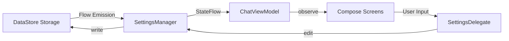

# 16_SETTINGS_SYSTEM.md

## Overview
Agora implements a reactive, persistent settings system using **Jetpack DataStore Preferences**. It manages everything from UI themes to sensitive API credentials and complex agentic behaviors. The system is designed to be highly granular, allowing per-conversation overrides for most AI parameters.

## Core Components

### 1. `SettingsManager.kt`
- **Role**: The low-level DataStore accessor.
- **Implementation**:
    - Defines `Preferences.Key` for every setting (approx. 80+ keys).
    - Exposes settings as `Flow<T>` for real-time UI observation.
    - Provides `suspend` save methods that use `dataStore.edit { }`.
- **Key Settings Groups**:
    - **AI Configuration**: `selectedModel`, `maxContextWindow`, `thinkingLevel`.
    - **Automation**: `autoBackupEnabled`, `exactExecutionEnabled`, `autoCacheEnabled`.
    - **UI/UX**: `themeMode`, `colorScheme`, `fontPreference`, `hapticsEnabled`.
    - **Networking**: `proxyEnabled`, `proxyType`, `proxyHost`, etc.

### 2. `SettingsDelegate.kt` (ViewModel Layer)
- **Role**: Business logic wrapper for settings modifications.
- **Implementation**: Extracted from `ChatViewModel` to reduce its complexity. It handles complex writes, such as updating maps of model aliases or managing the list of active API keys.

## Security & Sensitive Data
Agora prioritizes "BYOK" (Bring Your Own Key) and ensures that these keys never leave the device in plaintext.
- **`ApiKeyEntry`**: Data class for storing keys per provider.
- **Encryption**: `SettingsManager` uses `SecretCrypto.encrypt()` before storing keys in DataStore. This uses AES-256-GCM with keys wrapped by the Android Keystore.
- **Cleartext Guard**: The network layer refuses to send these headers over unencrypted HTTP (except for local hosts).

## Preference Hierarchy & Overrides
Agora supports a "Global -> Per-Conversation" override system via the `ConversationSettings` data class.
1. **Global Default**: Set in the "Generation" settings page.
2. **Conversation Override**: Users can tap the "Settings" icon in the input bar to set specific temperature, max tokens, or tool toggles for *just that chat*.
3. **Model Specifics**: Some models (like Gemini) have native tools (Code Execution) that are toggled via specialized settings.

## Data Structures

### `ApiKeyEntry` (Serializable)
- `id`, `name`, `key`, `provider`.

### `SystemPromptEntry` (Serializable)
- Represents a three-section prompt template:
    - **System**: The core persona.
    - **User Prepend**: Text added before the user's message (e.g., date/time).
    - **User Postpend**: Text added after the user's message.

### `ShellDeviceConfig` (Serializable)
- Stores connection details for Conch or SSH servers, including pinned public keys for TOFU (Trust-On-First-Use) security.

## Reactivity Flow

## Possible Improvements
- **Setting Snapshots**: Ability to export/import specific settings profiles (e.g., "Creative Mode" vs. "Coding Mode") separately from the full database.
- **Validation**: Moving validation logic (e.g., cron expression check) directly into `SettingsManager` to ensure the data store never contains invalid state.
