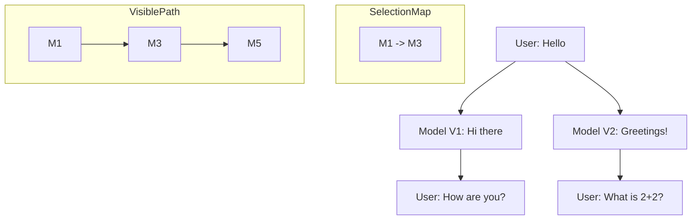

# 17_CHAT_SYSTEM.md

## Overview
The Chat System is the most prominent feature of Agora, managing the complex lifecycle of non-linear conversations. Unlike traditional chat apps that use a flat list, Agora employs a **Tree-based Architecture** that allows users to branch off from any point in history, regenerate responses, and explore multiple AI paths simultaneously.

## Core Architectural Components

### 1. `ChatViewModel.kt`
The central orchestrator for the foreground UI.
- **State Management**: Combines multiple data sources (`_allMessages`, `_streamingMessage`, `_selectedChildren`) into a unified `messages` StateFlow for the UI.
- **Delegation**: Offloads heavy business logic to specialized controllers like `MessageGenerationController` and `GenerationSession`.
- **Navigation**: Tracks the `currentConversationId` and handles the transition between different chat sessions.

### 2. `MessageGenerationController.kt`
Extracted from the ViewModel to manage the high-level message lifecycle.
- **Responsibilities**:
    - `sendMessage()`: Handles attachment processing, new conversation creation, and title generation.
    - `regenerate()`: Creates a new sibling message in the tree and triggers a new generation.
    - `editMessage()`: Allows modifying a past user message, creating a brand new branch from that parent.
    - `deleteMessage()`: Implements a BFS (Breadth-First Search) cascade to delete a message and all its descendants.

### 3. `ConversationUiState.kt`
Contains the critical **Path Resolution** logic.
- **`resolvePath()`**: This method walks the tree starting from the root (`parentId = null`). At each level, it checks the `selectedChildren` map to decide which branch to follow. If no selection exists, it defaults to the most recent sibling.
- **Synthetic Message Handling**: It filters out internal `tool_` and `result_` messages from the UI path while ensuring they remain in the database for AI context.

## The Message Tree Structure
- **Root**: Messages with `parentId = null`.
- **Branching**: Occurs when a single message has multiple children.
- **Persistence**: Stored in the `messages` table of the Room database.
- **UI Interaction**: The `MessageItem` composable provides "Next/Previous" buttons to switch between siblings, which updates the `selectedChildren` map in `ChatViewModel`.

## Generation Lifecycle (`GenerationSession`)
An inner class of `ChatViewModel` that manages the temporal state of a model response.
- **Token Gating**: Uses a monotonically increasing `uiToken` to ensure that only the latest generation attempt can update the screen. If a user taps "Stop" and "Regenerate" quickly, the old stream is invalidated.
- **Handshake**: Coordinates between the `GenerationManager` (background engine) and the UI (StateFlows).

## Data Flows

### Message Send Flow
1. User enters text and attaches a PDF.
2. `ChatBottomBar` calls `viewModel.sendMessage()`.
3. `MessagePayloadBuilder` renders the PDF pages to local images and extracts text.
4. A `Participant.USER` message is saved to DB.
5. A placeholder `Participant.MODEL` message with `status = SENDING` is saved.
6. `GenerationManager` starts the streaming loop.
7. `ChatViewModel` receives chunks and updates the `streamingMessage` StateFlow.

### Branching Flow
1. User taps "Regenerate" on an AI response.
2. `regenerate()` is called with the `messageId`.
3. A new `modelMessage` is created with the **same parent** as the original message.
4. The `selectedChildren` map is updated to point to the new ID.
5. `resolvePath()` re-runs, and the UI now shows the new branch starting from that point.

## Diagram: Tree to Path Resolution

## Possible Improvements
- **Message Search**: Improved highlighting within the resolved path.
- **Tree Visualization**: A dedicated "Map View" to navigate extremely complex multi-branch conversations.
- **Archiving**: The ability to collapse or archive specific branches to reduce database overhead.
吐
吐
