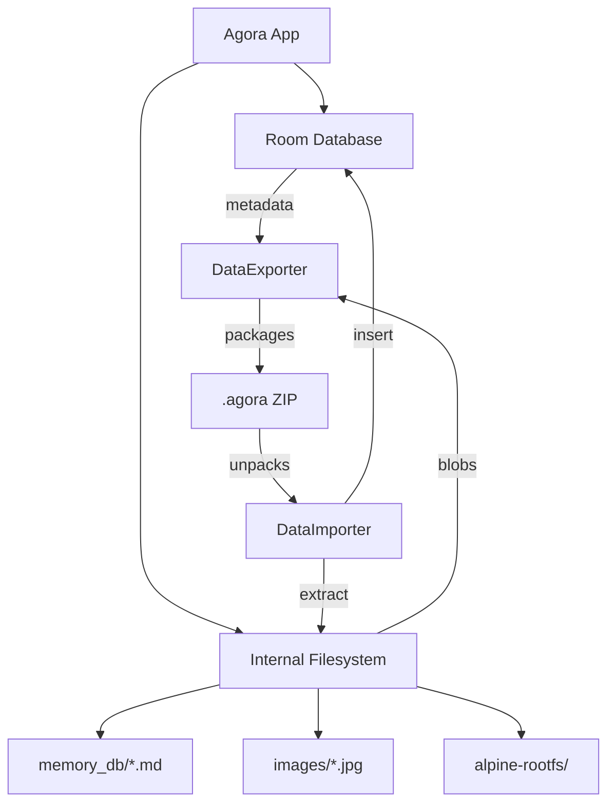

# 18_FILE_SYSTEM.md

## Overview
Agora manages a diverse range of files on the device filesystem, from small JSON metadata and large GGUF model binaries to complex agentic memory documents. It follows standard Android data storage practices while providing sophisticated import/export capabilities for data portability.

## Storage Locations

### 1. Internal Storage (`context.filesDir`)
This is the primary location for app-private data.
- **`images/`**: Stores processed image attachments for chat messages.
- **`vid_original_*.mp4`**: Local copies of video attachments to ensure they survive even if the original gallery source is deleted.
- **`memory_db/`**: Markdown files representing the model's long-term memory.
- **`alpine-rootfs/`**: The extracted root filesystem for the PRoot Sandbox.
- **`lib/`**: Native binaries (`libproot_exec.so`, `libtalloc.so.2`) extracted from the APK for execution.
- **`custom_font_*`**: User-uploaded TTF/OTF files for UI customization.

### 2. Assets (`app/src/main/assets`)
Bundled files shipped inside the APK.
- **`agora_transparent_large.png`**: Branding icons.
- **`libproot_exec.so`**: (Packaged here before extraction to `jniLibs` or `filesDir`).

### 3. External Storage (Scoped)
- **`Download/Agora/Backup/`**: Default directory for automated and manual backups.

## Data Portability (`.agora` Format)
The `.agora` file is actually a standard **ZIP archive** containing a snapshot of the app's state.

### ZIP Structure:
- **`manifest.json`**: Contains export version, app version, and timestamp.
- **`conversations.json`**: The complete graph of `conversations`, `messages`, `tasks`, and `loops`.
- **`settings.json`**: Global application preferences.
- **`api_keys.json`**: (Optional) Encrypted or plaintext API credentials.
- **`memories/`**: Subfolder containing `active_memory.md` and the `memory_db/` documents.
- **`images/<messageId>/<index>`**: Raw image data for chat attachments.
- **`custom_font/`**: The user's custom font file.

## Data Management Logic

### `DataExporter.kt`
- **Streaming Export**: Uses `ZipOutputStream` to build the backup file incrementally.
- **Selective Export**: Allows the user to choose specific categories (e.g., only "Memories" or only "Settings").
- **Asset Collection**: Resolves `content://` URIs for gallery images and copies them into the ZIP to ensure the backup is self-contained.

### `DataImporter.kt`
- **Strategies**:
    - **MERGE**: Adds new items without overwriting existing ones.
    - **REPLACE**: Clears the local database and files before importing the ZIP content.
    - **SKIP**: Ignores specific categories.
- **Sanitization**: Important for security. Imported `TaskEntity` objects are always restored as `enabled = false` to prevent background AI turn execution immediately after import without user review.
- **Path Verification**: Implements path traversal checks when extracting memory files.

## Automated Backup (`AutoBackupManager.kt`)
- **Framework**: `WorkManager` triggers a periodic backup job.
- **Concurrency**: Uses a global `Mutex` to ensure that a background backup doesn't race with a manual export.
- **Retention**: Implements an "Auto-Delete" policy (e.g., "Keep the last 7 days of backups") to save storage space.

## File System Interaction Diagram

## Security Model
- **App-Private**: Files in `context.filesDir` are not accessible to other apps except through the `SandboxDocumentsProvider` (which is gated by Android permissions).
- **Encryption**: While `settings.json` is plaintext, API keys in `api_keys.json` are typically re-encrypted or omitted based on user choice during export.
吐
吐
