# TAJ EGYPT AI Agent Platform - Single Source of Truth

## 1. Project Identity & Philosophy
**TAJ EGYPT** is a professional-grade, modular AI Agent Platform for Android. Born from the **Agora** chat application, it has been transformed into a decentralized execution environment where "Everything is an Agent."

### Core Tenets:
- **Data Sovereignty**: Your keys, your models, your data. Local-first storage with hardware-backed encryption.
- **Agentic Autonomy**: AI entities are not just chat partners; they are workers with memory, tools, and reasoning capabilities.
- **Infinite Extensibility**: Support for any cloud provider and external tools via the **Model Context Protocol (MCP)**.
- **Deep Android Integration**: Leveraging the mobile OS to provide a ubiquitous intelligent layer.

---

## 2. Historical Timeline

### Phase 0: The Origin (Agora)
- **Repo**: Forked from the original Agora chat application.
- **Architecture**: Monolithic `:app` module with basic LLM provider support.
- **Storage**: Room DB v1-v12.

### Phase 1: Modular Transformation (Roadmap V1)
- **Action**: Created core modules: `:core:model`, `:core:agent`, `:core:tool`, `:core:memory`.
- **Result**: Clean architecture, circular dependency resolution.

### Phase 2: Strategic Reasoning & Workspace (Roadmap V1)
- **Action**: Created `:core:reasoning`, `:core:workspace`.
- **Result**: Plan-Execute-Reflect loop, isolated file environments.

### Phase 3: Platform Scale (Roadmap V2)
- **Action**: Created `:core:plugin`, `:core:network`, `:core:security`, `:core:learning`, `:core:collaboration`, `:core:ghost`, `:core:sensory`, `:core:stats`.
- **Result**: Multi-agent collaboration, deep OS control, biometric security, autonomous learning.

### Phase 4: Production Hardening (Roadmap V3)
- **Action**: Created `:benchmark`, `:core:cache`, `:core:util`.
- **Key Features**: Baseline profiles, multi-tier caching engine, battery-aware execution, DB performance indices, engine testing framework.

---

## 3. Technical Architecture

### 3a. Module Dependency Graph

```mermaid
graph TD
    App[:app] --> CoreAgent[:core:agent]
    App --> CoreTool[:core:tool]
    App --> CoreMemory[:core:memory]
    App --> CoreReasoning[:core:reasoning]
    App --> CoreWorkspace[:core:workspace]
    App --> CorePlugin[:core:plugin]
    App --> CoreSecurity[:core:security]
    App --> CoreNetwork[:core:network]
    App --> CoreLearning[:core:learning]
    App --> CoreCollaboration[:core:collaboration]
    App --> CoreGhost[:core:ghost]
    App --> CoreSensory[:core:sensory]
    App --> CoreStats[:core:stats]
    App --> CoreCache[:core:cache]
    App --> CoreUtil[:core:util]
```

### 3b. Database Schema & Migration History
**Room Database**: `ChatDatabase.kt`
**Current Version**: 32

| Version | Key Changes |
| :--- | :--- |
| 15-27 | Agentic platform foundation (Agents, Sessions, Memories, Reasoning, Workspaces, Plugins). |
| 28 | Added `agent_experiences` and `user_preferences`. |
| 29 | Added `agent_messages` and `agent_teams`. |
| 30 | Added `platform_stats`. |
| 31 | Added performance indices (Startup/Search optimization). |
| 32 | Added `cache_entries` (Multi-tier caching). |

---

## 4. Current Feature Set (V3.0 Roadmap Complete)

- **Agent Engine**: Autonomous state machine with MAC support.
- **Reasoning Engine**: Strategic planning and reflection.
- **Memory Engine**: Multi-tier RAG with semantic search.
- **Ghost Engine**: Deep OS control via Accessibility Service.
- **Sensory Engine**: Real-time STT/TTS voice mode.
- **Caching Engine**: High-performance persistent cache.
- **Security Engine**: Biometric gating and encrypted workspaces.

---

## 5. Implementation Status

- **Roadmap V1 (Foundations)**: 100%
- **Roadmap V2 (Features)**: 100%
- **Roadmap V3 (Production)**: 90%
    - Performance & Latency: 100%
    - Battery & Resource: 100%
    - Caching Architecture: 100%
    - Multi-Layer Testing: 60%
    - Benchmarking: 50%
    - Security Hardening: 80%

---

## 6. Known Limitations & Future Goals

- **Public Plugin Store**: Community catalog for MCP servers.
- **Vision Optimization**: Real-time video frame processing.
- **v1.0 Distribution**: Final polishing for public release.
吐
吐
